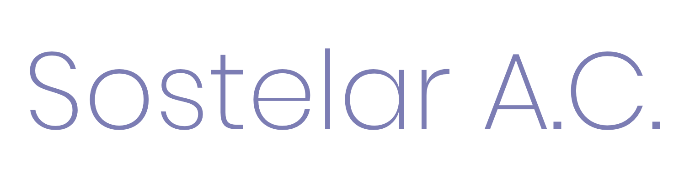

# Sostelar A.C. website

## Background
Sostelar A.C. is an NGO operating in Monterrey, Mexico, who helps women who have been a victim of violence through workshops about ethics, finance and psychology.
 
Through one of my university's social service groups called ThunderMX, my team and I designed and developed a website for this NGO.

## To-do

### General
- [x] ~~Add a horizontal rule below every section title [like this](https://www.w3schools.com/w3css/tryw3css_templates_interior_design.htm).~~
- [ ] Add smooth scroll [like this](http://iamdustan.com/smoothscroll/).
- [x] ~~Center text in title-section~~

##### Navbar
- [ ] Fix scrollspy (Not working) [useful info](https://www.w3schools.com/bootstrap/bootstrap_scrollspy.asp).

### Sections
##### Que ofrecemos
- [ ] Make all images full height of the container
- [ ] Try adding shadows to images
- [ ] Add name of all projects below each image
- [ ] Add modal to all (3) projects

##### Alianzas
- [ ] Add logos of ally organizations
- [ ] Add links to the logos

##### Equipo
- [ ] Add an image and name of each team member(5).
- [ ] Add modal to images to display experience, etc.

##### Contacto
- [x] ~~Add link to both phone numbers (If on mobile add link to call the number)~~
- [x] ~~Add mailto link~~
- [x] ~~Add link to facebook page~~
- [x] ~~Add link to Google Maps~~
- [ ] Add verification information to the form
- [ ] Add functionality to "Enviar" button, making the input information be send as an email to Sostelar's email.
- [ ] Change "Enviar" button's colors

##### Footer
- [x] ~~Add link to ThunderMX~~
